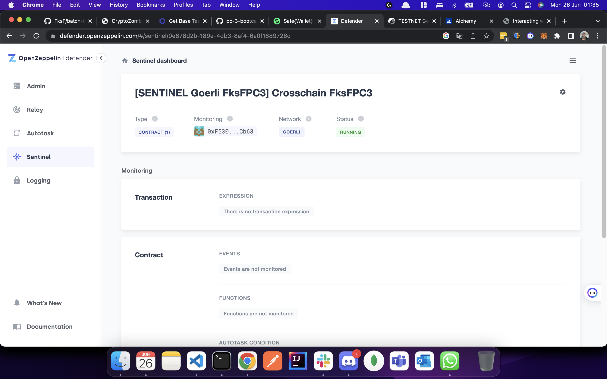
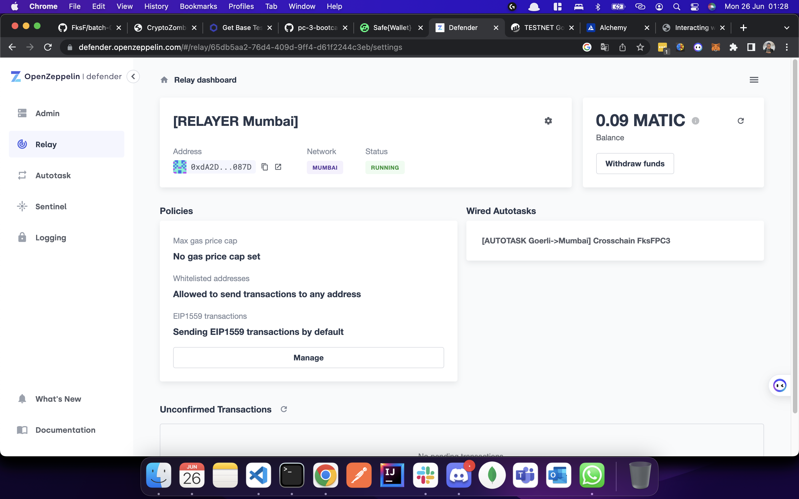
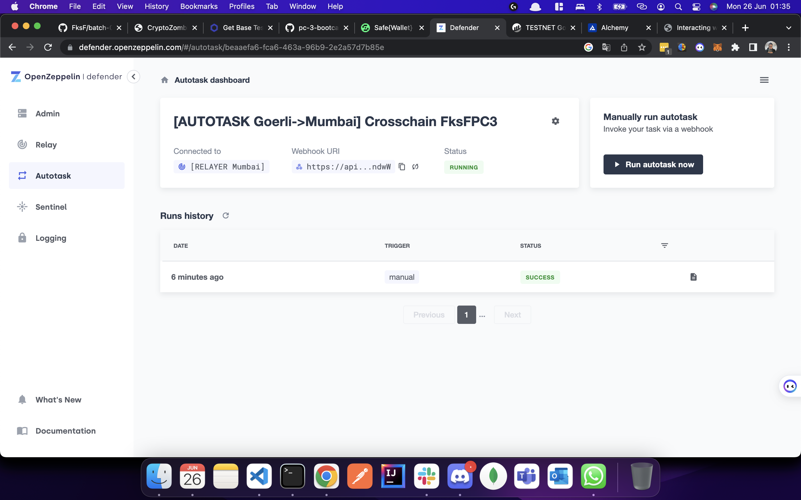
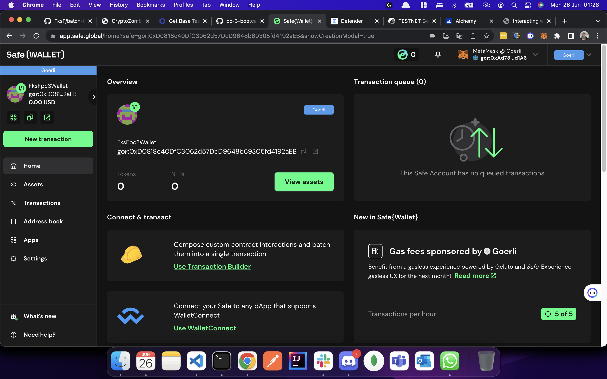

# Solution
MUMBAI
MiPrimerNftFksF Proxy Address: 0x2775Dd53D58fE3306A76518ce1289BEa5cE1ABb4
MiPrimerNftFksF Impl Address: 0x73BCFa45d48974FdEafA1E9fE0926C4b176354a9
MiPrimerNftFksF Address:  0x2775Dd53D58fE3306A76518ce1289BEa5cE1ABb4

GOERLI
USDC Address:  0x58fAf8E376AE31B98fc758ec0BD4A28d9fe4Dd25

MiPrimerTokenFksF Proxy Address: 0xC70a1D00e5015Ea67369c763BFE7587dbD98b094
MiPrimerTokenFksF Impl Address: 0xbC2fF316EdF87F71a6B1b29F93Cf469e776A8148

PublicSale Proxy Address: 0xF530Ee99444BCbcC2a351A290Bb0526A38eBCb63
PublicSale Impl Address: 0xc9D3C14A00077d7EfcaB14b5583B85C81752b441

EVIDENCIAS

# Bootcamp Presencial - Batch 01

## Práctica Calificada 3

Estás a punto de lanzar una colección de NFTs para tu comunidad. Escoges la red Polygon (Mumbai) dado que es la red más popular para este tipo de proyectos. Tus usuarios poseen los fondos en la red Ethereum (Goerli) y prefieres que se realice la compra en esta red y luego, cross-chain, acuñar los NFTs en Polygon.

En principio, tus usuarios poseen el token USDC, que es una moneda estable. Sin embargo, el contrato de compra y venta de NFTs solamente acepta el token de tu proyecto (MiPrimerToken) para proceder con la compra. Ello implica que antes de realizar la compra, un usuario cambiará sus USDC por MiPrimerToken en un casa de cambios descentralizada (DEX - UNISWAP).

Realizar el swap de tokens en un DEX require que en primer lugar se cree un pool de liquidez de un par de tokens. Es decir, que en dicho pool se depositen una cierta cantidad de cada token. La cantidad a depositar de cada token determinará el tipo de cambio a usar en los swaps mientras exista el pool de liquidez. Ello permitirá que un usuario utilice UNISWAP para intercambiar USDC por MiPrimerToken usando el pool de liquidez creado. Este intercambio se puede realizar tanto de manera manual en la app de UNISWAP o de manera programática en un contrato inteligente

Para asegurar la conveniencia del usuario y éxito de tu proyecto, has creado una arquitectura de contratos y middleware (Open Zeppelin Defender) que consta de las siguientes partes:

1. Token ERC20 (llamado MiPrimerToken)
2. NFT ERC721 (usar coleccion de cuyes)
3. Compra y Venta de NFTs (Public Sale)
4. USDC (stable coin)
5. Open Zeppelin Defender (Middleware)
6. IPFS
7. Pool de liquidez (Par: USDC y MiPrimerToken - UNISWAP)
8. Front-end

Las redes a usar son las siguientes:

1. <u>Red Ethereum (Goerli):</u> Token ERC20, USDC y contrato de Compra y Venta

2. <u>Red Polygon (Mumbai):</u> Contrato de NFT

Contratos actualizables:

1. <u>Contratos actualizables:</u> Token ERC20, NFT smart contract y Compra y Venta

2. <u>Contrato no actualizable:</u> USDC. Tiene seis (6) decimales.

### **Token ERC20 MiPrimerToken (Goerli)**

Este contrato sigue el estándar ERC20 y tiene el método `mint` protegido. Este token será el otro par usado en la creación del pool de liquidez. Su publicación se dará en la red Goerli. Es el único token usado para comprar NFTs. Tiene dieciocho (18) decimales.

### **Contrato NFT (Mumbai)**

Este contrato permite la acuñación de los NFTs en la red Mumbai. La compra se realiza en el contrato de Compra y Venta en Goerli y a través de eventos se dispara la acuñación de NFTs en Mumbai. Funciona como un contrato satélite y el usuario final nunca interactúa con este contrato.

Las características de este contrato son las siguientes:

1. Todos los métodos de este contrato son protegidos. La única address con el privilegio de poder llamar métodos del contrato NFT es el Relayer de Open Zeppelin.
2. Los treinta elementos de la colección, se dividen en tres grupos: comunes, raros y legendarios. Cada grupo tiene diez elementos ordenados de manera secuencial. Comunes: 1 - 10; raros: 11 - 20 y legendarios: 21 - 30.
3. No se realiza la compra en este mismo contrato. Este contrato solo realiza acuñaciones de NFT instruidos por el Relayer de OZ.

### **Contrato de Compra y Venta de NFTs (Goerli)**

Este contrato de publica en la red Goerli. Sirve de interface para realizar la compra de NFTs. El usuario deposita MiPrimerToken en el contrato de Compra y Venta para poder adquirir un NFT en la red Mumbai. La comunicación entre el contrato de Compra y Venta y el contrato de NFTs se dará a través de Open Zeppelin Defender. El contrato de Compra y Venta emite eventos que serán escuchados por Open Zeppelin Defender, que a su vez ordenará al contrato de NFT en Mumbai de acuñar un determinado NFT.

Las características de este contrato son las siguientes:

1. Primera modalidad de compra: el contrato de Compra y Venta se transfiere una cantidad de MiPrimerToken del usuario para pagar uno de los tipos de NFT. A cambio, el contrato de Compra y Venta emite un evento con la información apropiada que será escuchado por Open Zeppelin Defender.
2. Segunda modalidad de compra (BONUS): el contrato de Compra y Venta recibe USDC del usuario. Al hacerlo, utiliza UNISWAP para hacer la conversión de USDC a MiPrimerToken en una cantidad que es suficiente para poder pagar uno de los tipos de NFT disponibles. A cambio, el contrato de Compra y Venta emite un evento con la información apropiada que será escuchado por Open Zeppelin Defender.
3. Hay tres grupos de NFTs (común, raro y legendario). Cada grupo tiene un diferente precio para poder ser adquirido. Los comunes tienen un precio flat de quinientos (500) MiPrimerToken. Los raros poseen un precio que es el resultado de multiplicar su id por mil. Es decir, el raro con id #11 costará 11,000 MiPrimerToken, mientras que el raro con id #20 costará 20,000 MiPrimerToken. Los legendarios tienen un precio que cambia en función de la cantidad de horas pasadas desde las 00 horas del 17 de Junio del 2023 GMT (obtener el timestamp en [epoch converter](https://www.epochconverter.com/)). El precio base empieza en 10,000 MiPrimerToken. Por cada hora pasada, el precio se incrementa en 1,000 MiPrimerToken. El precio máximo para un NFT legendario es de 50,000 MiPrimerToken.
4. Un usuario puede depositar 0.01 Ether para poder obtener un NFT aleatorio. Este NFT será escogido de uno de los que se encuentren disponibles en el contrato de NFT en Mumbai. Además, en este método, en caso se envíe por equivocación un monto mayor a 0.01, el smart contract debería "dar vuelto". Solo ejecutar este método si aún quedan algún NFT de la colección de treinta disponibles. Para realizar el depósito un usario puede llamar un método del smart contract o simplemente enviar Ether al smart contract.
5. Se usará una billetera de un baúl (safe) creado en Gnosis Safe. Dicha billeterá recibirá la totalidad de transferencias en Ether y el 10% de las transferencias en MiPrimerToken. Ello quiere decir que en ningún momento el contrato guardará Ether pero sí tendrá un balance de MiPrimerToken.
6. Crear un método que permite recuperar lo tokens de MiPrimerToken almacenados en este contrato. Dicho método debe estar protegido y solo el admin/owner del contrato lo puede llamar. Todos los MiPrimerToken del contrato Compra y Venta son transferidos al llamante del método.
7. No se pueden acuñar más de treinta (30) NFTs. Definir la validación apropiada en el contrato.

### **Contrato USDC (Goerli)**

Este contrato sigue el estándar ERC20 y tiene el método `mint` protegido. Este token simula la poseción de dólares digitales. Su publicación se dará en la red Goerli. Su función es la de proveer fondos para iniciar las operaciones de compra. Tiene seis (6) decimales.

### **Open Zeppelin**

- Relayer: crea un signer para firmar las transacciones en la red Mumbai. Este signer se utiliza en el script definido en el autotask. Recordar que el address del Relayer debe poseer un privilegio para que pueda llamar al método de acuñación del smart contract de NFTs.
- Autotask: script que se ejecuta a raíz de la escucha de eventos que vienen del smart contract de venta pública (public sale) de NFTs en Goerli. Este script se encarga de llamar al contrato de NFTs para acuñar un NFT usando la información proveniente en el evento del Sentinel
- Sentinel: escucha los eventos que se emiten a raíz de la compra de NFTs en el contrato de venta pública (Goerli). A su vez, el sentinel se encarga de llamar el autotask que permite la acuñación de NFTs en Mumbai.

### **IPFS**

1. Dentro de la carpeta `ipfs` tenemos a `images_30` y `metadata_30`. Estas dos carpetas representan a los activos digitales y la metadata, respectivamente.
2. Guardar la carpeta de activos digitales (`images_30`) en la aplicación de escritorio IPFS. Obtener el CID luego de guardar la carpeta.
3. Dentro de la carpeta de metadata (`metadata_30`), se encontrarán los archivos `json` enumerados de manera secuencial. Cada archivo `json`, representa la metada de un activo digital en particular. Por ejemplo, el archivo `0.json`, representa la metadata del activo digital `0.png`, guardada en la otra carpeta (`images_30`).
4. Se van a modificar los archivos de metadata. Buscar la propiedad `image` dentro del archivo `json`. Notar que esta propiedad también está enumerada. Esta propiedad tiene por valor `ipfs://[enter the CID here]/0.png`. Reemplazar por el valor del CID obtenido en el punto 2
5. No modificar los atributos de los archivo `json`. Dado que hay tres grupos diferentes de NFTs, modificar el atributo `name` de cada archivo `json` para que represente más apropiada el grupo de NFT al que pertenece (común, raro o legendario).
6. Escoger una descripción apropiada para que represente la colección de NFTs que estás creando. Para lograr ello cambiar el atributo `description` del archivo `json`.
7. De manera opcional se pueden agregar más atributos en la propiedad `attributes`. Seguir la guía/estándar definido en la página de Open Sea que lo puedes encontrar [aquí](https://docs.opensea.io/docs/metadata-standards). Estos atributos serán vistos en la galería de Opean Sea.
8. Luego de terminar de editar los archivos de metadata, guardar la carpeta `metadata_30` en `ipfs` para poder obtener el CID. Finalmente, este CID es el que se guardará en el smart contract en el método `tokenURI`. Gracias a este método, el smart contract puede encontrar la metadata y el activo digital en el IPFS.

### **Front-End**

Crear un front minimalista para poder interactuar con el contrato de Venta Pública. En este front, se podrán realizar las siguientes operaciones:

1. Dar approve de MiPrimerToken al contrato de venta pública
2. Comprar un NFT usando un ID
3. Llamar al método de comprar un NFT random enviando ether
4. Enviar ether directamenete al contrato inteligente
5. Visualizar la acuñación y delivery de NFTs en Mumbai

### Videos explicativos

He creado esta serie de videos que ayudan a entender la PC3. Está en el orden en que deben ser vistos.

[Todos los videos](https://drive.google.com/drive/folders/1KO_shOZ699Bm1cCDkWdhGLy8yosc8fX4?usp=sharing)

1. [Empieza aquí](https://drive.google.com/file/d/1iNsIvQPY2goXGUh6UVGS8U5Y-hbJ1J40/view?usp=sharing)
2. [Repositorio parte 1](https://drive.google.com/file/d/1S_BKWOCZ8L_x_glp7n0SjnzbCbKhqyCX/view?usp=drive_link)
3. [Repositorio parte 2](https://drive.google.com/file/d/17AKNrp7hc8L4A0P3ApptJwjOULrfLxrY/view?usp=drive_link)
4. [Front-end final](https://drive.google.com/file/d/1KNxZhOfkheN8KQ2_Ss6LkwjIpi8Bl0Ck/view?usp=drive_link)
5. [Open Zeppelin Defender](https://drive.google.com/file/d/1yfQoXsqV7SdW1Ms9MHOGiZVkaOCqtE5o/view?usp=drive_link)
6. [Envio de Ether al SC](https://drive.google.com/file/d/1ssSH-OVm8mX8EpKp4EL2CVeNmgchP2VU/view?usp=drive_link)
7. [Swap USDC=>MiPrimerToken](https://drive.google.com/file/d/11kgYB4o3SdmHUM0qVIleXWl1HugAZk_b/view?usp=drive_link)

